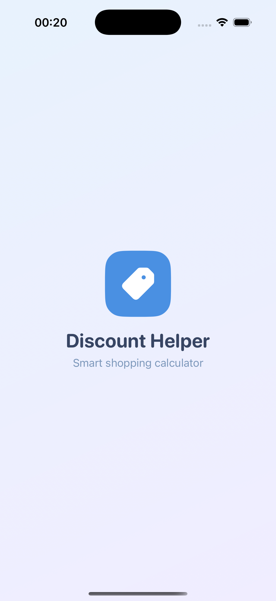
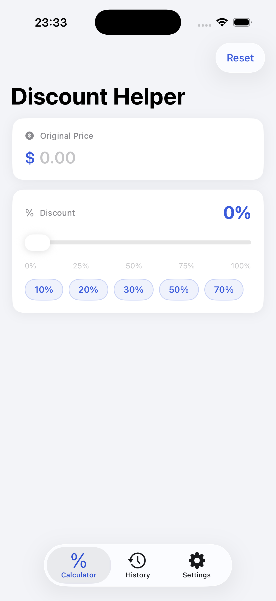
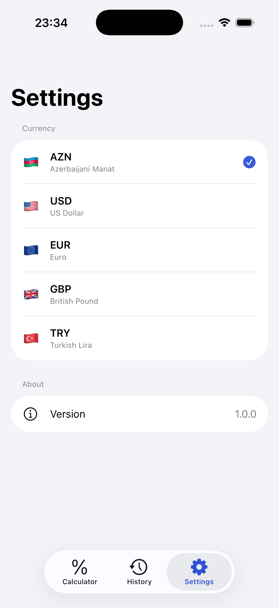
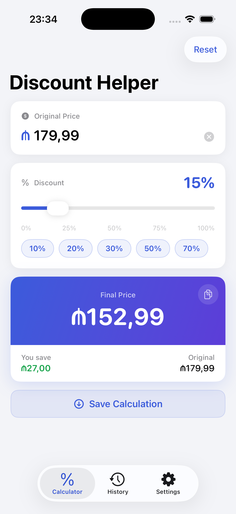
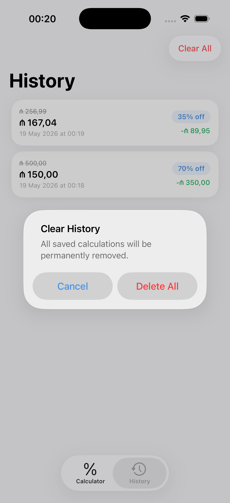

# DiscountHelper

iOS app built with SwiftUI for calculating discounted prices instantly while shopping. Supports multiple currencies, saves calculation history, and works in dark mode.

## Screenshots

<p align="center">
  
  
  
</p>
<p align="center">
  
  
</p>

## Features

- **Calculator** — Enter price and select discount percentage with a slider or quick-pick chips (10%, 20%, 30%, 50%, 70%)
- **Real-time Results** — Final price and savings calculated instantly with Combine (30ms debounce)
- **Multi-Currency** — AZN, USD, EUR, GBP, TRY with flag icons and formatted output
- **History** — Save calculations, view details, swipe to delete, clear all with confirmation
- **Share & Copy** — Copy result to clipboard or share via system share sheet
- **Settings** — Currency picker with persistent selection
- **Dark Mode** — Fully adaptive UI with context-aware shadows
- **Splash Screen** — Animated logo with spring physics
- **Haptic Feedback** — Tactile response on key interactions

## Tech Stack

| Layer | Technology |
|-------|-----------|
| UI | SwiftUI, Combine |
| Architecture | MVVM |
| State | @StateObject, @Published, @EnvironmentObject |
| Persistence | UserDefaults (Codable) |
| Animations | Spring physics, numeric text transitions |
| Design | Centralized design tokens, brand gradient |
| Min. iOS | 17.0 |

## Project Structure

```
DiscountHelper/
├── Models/
│   ├── Currency.swift            # AppCurrency enum (5 currencies)
│   └── CalculationRecord.swift   # Codable calculation snapshot
├── ViewModels/
│   ├── CalculatorViewModel.swift # Reactive calculation logic
│   ├── HistoryStore.swift        # Calculation history persistence
│   └── CurrencyStore.swift       # Selected currency persistence
├── Views/
│   ├── SplashView.swift          # Animated splash screen
│   ├── MainTabView.swift         # Tab navigation (3 tabs)
│   ├── CalculatorView.swift      # Main calculator screen
│   ├── HistoryView.swift         # Saved calculations list
│   ├── DetailView.swift          # Calculation breakdown + share
│   ├── SettingsView.swift        # Currency picker + app info
│   ├── HistoryRowView.swift      # History list row card
│   └── Components.swift          # Reusable UI primitives
├── DesignTokens.swift            # Colors, typography, styling
└── Assets.xcassets/
```

## License

This project is available under the MIT License.
